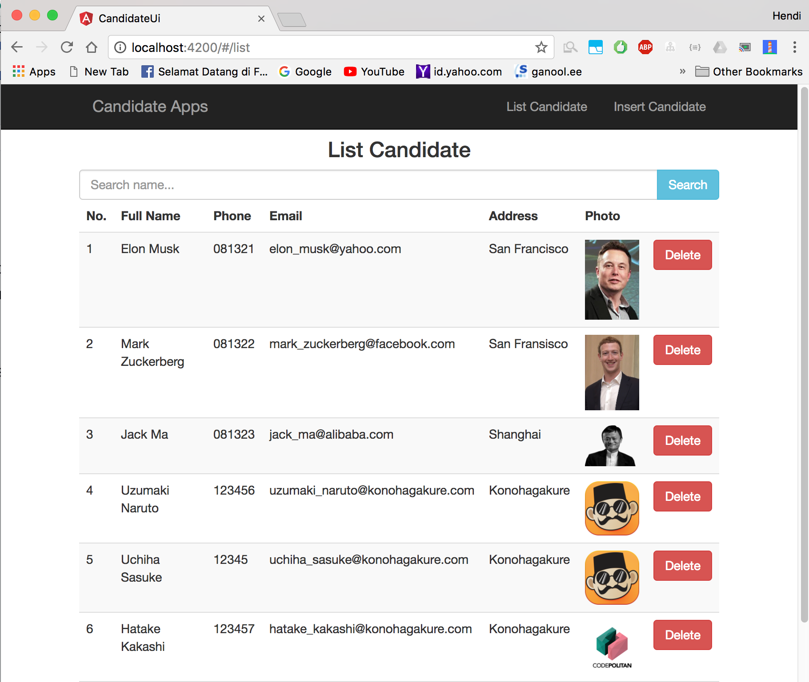
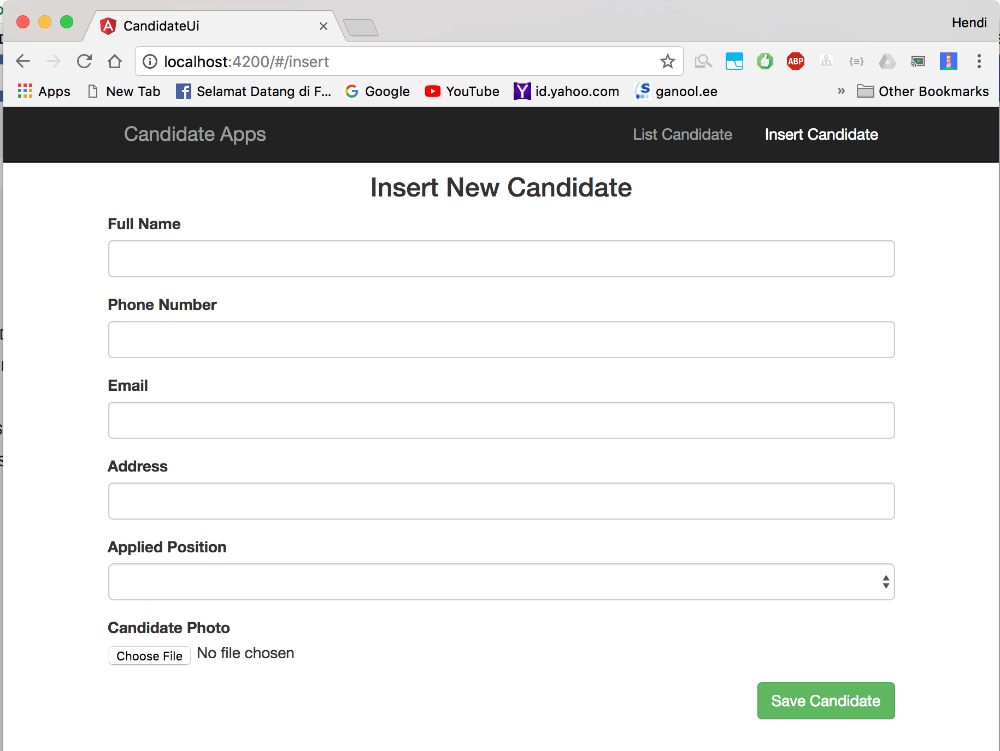

# Spring Boot Angular 4

# This is just simple integration between Spring Boot with Angular 4

# To run this project, please follow these instruction :

1. Go to `candidate-app` folder then paste this command `mvn clean spring-boot:run`.
2. Go to `candidate-ui` folder then paster this command `npm install` then `ng serve`.

